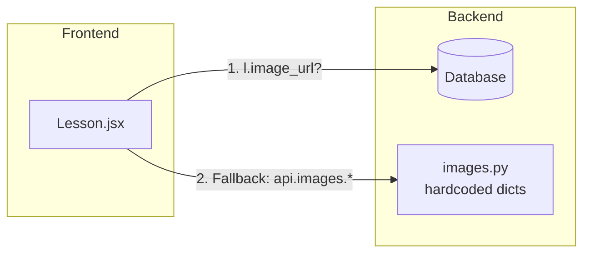

## Overview

Esta mudança conecta a infraestrutura já existente — `Lesson.image_url` no banco, `LessonUpdate` schema, `PATCH /admin/lessons/{id}` endpoint — com o frontend administrativo e o seed, de modo que as imagens das lições sejam **armazenadas e gerenciadas no banco de dados**, editáveis via interface `/admin`.

## Architecture

### Fluxo atual (runtime)



O frontend primeiro verifica `lesson.image_url`. Se for `null` (o que acontece para frases e orações), faz uma segunda requisição para `/api/images/text/{target}`, que consulta os dicionários hardcoded em `images.py`.

### Fluxo proposto

```mermaid
flowchart LR
    subgraph Frontend
        L[Lesson.jsx]
        A[Admin.jsx<br/>ContentTab]
    end
    subgraph Backend
        DB[(Database)]
        IMG[images.py<br/>resolvedor]
        SEED[seed.py]
        BF[backfill_lesson_images.py]
    end

    BF -->|popula| DB
    SEED -->|popula| DB
    A -->|PATCH /admin/lessons/{id}| DB
    L -->|l.image_url sempre preenchido| DB
```

**Mudanças**: 
- Seed e backfill populam `lessons.image_url` para **todas** as lições usando a lógica de `images.py`.
- Admin pode sobrescrever `image_url` individualmente via `PATCH /admin/lessons/{id}`.
- Frontend lê `lesson.image_url` diretamente, sem fallback.

## Data model

Nenhuma migração de schema é necessária. O modelo `Lesson` já possui:

```
lessons
├── image_url       : String(500), nullable  ← será populado (nunca null)
├── image_active    : Boolean, default=True   ← controla exibição
├── alt_text        : String(500), nullable   ← texto alternativo
├── placeholder_text: String(200), nullable   ← texto de placeholder
```

## Seed strategy

### Problema atual

`seed.py` mantém **cópias independentes** dos dicionários de `images.py` (`EMOJI_MAP`, `SYLLABLE_EMOJI_MAP`, `WORD_EMOJI_MAP`) e a função `get_lesson_image_fields()` só popula `image_url` para `letter`, `consonant`, `syllable` e `word`.

Para `phrase` e `sentence`, usa `**CMS_DEFAULTS`, que define `image_url = None`.

Para `blending`, também não popula.

### Solução

1. `seed.py` passa a **importar** `images.py` e usar suas funções:
   - `get_emoji_for_letter(letter)` para `letter` / `consonant`
   - `get_emoji_for_syllable(syllable)` para `syllable`
   - `get_emoji_for_word(word)` para `word`
   - `get_emoji_for_text(text)` para `blending`, `phrase`, `sentence`
   - `review` permanece sem imagem (`image_url = None`)

2. Os dicionários duplicados em `seed.py` são **removidos**.

3. `CMS_DEFAULTS` é simplificado para:
   ```python
   CMS_DEFAULTS = {
       "active": True,
       "image_active": True,
       "alt_text": None,
       "placeholder_text": None,
   }
   ```
   Só usado para `review`.

## Backfill strategy

### Script `backend/app/services/backfill_lesson_images.py`

Propósito: percorrer todas as lições existentes no banco e preencher `image_url` onde estiver `null`.

```python
def backfill_lesson_images(db: Session) -> int:
    count = 0
    lessons = db.query(Lesson).filter(Lesson.image_url.is_(None)).all()
    for lesson in lessons:
        url = resolve_image_for_lesson(lesson)
        if url:
            lesson.image_url = url
            count += 1
    db.commit()
    return count


def resolve_image_for_lesson(lesson: Lesson) -> str | None:
    from app.services.images import (
        get_emoji_for_letter,
        get_emoji_for_syllable,
        get_emoji_for_word,
        get_emoji_for_text,
    )
    t = lesson.lesson_type
    target = lesson.target
    if t in ("letter", "consonant"):
        return get_emoji_for_letter(target)
    if t == "syllable":
        return get_emoji_for_syllable(target)
    if t == "word":
        return get_emoji_for_word(target)
    if t in ("blending", "phrase", "sentence"):
        return get_emoji_for_text(target)
    return None
```

### Integração

- O script pode ser executado como um comando avulso (`python -m app.services.backfill_lesson_images`).
- Também é exposto como um botão no admin: **"Re-resolver imagens"** que chama `POST /admin/lessons/backfill-images`.

## Admin UI

### Aba "Conteúdo" — formulário de edição estendido

Atualmente, o formulário inline edita apenas `name`, `target`, `lesson_type`, `active`, `sort_order`.

Campos a adicionar:

```
URL da Imagem: [_______________________________]  ← image_url
Exibir Imagem: [☑]                              ← image_active
Texto Alternativo: [___________________________]  ← alt_text
Placeholder: [_________________________________]  ← placeholder_text
```

Esses campos já existem no schema `LessonUpdate` do backend. O frontend só não os envia.

### Botão "Re-resolver imagens"

Na aba "Conteúdo", um botão no cabeçalho:

```
[ 🔄 Re-resolver imagens ]
```

Ao clicar, chama `POST /admin/lessons/backfill-images`. O backend percorre todas as lições e repopula `image_url` com base na lógica de `images.py`. Lições com `image_url` personalizado (diferente do valor resolvido) **não** são sobrescritas.

## Lesson.jsx — resolutor de imagens

### Estratégia de 3 níveis

```
1. image_url preenchido E image_active = true
   → usar image_url diretamente (fonte primária)

2. image_url preenchido E image_active = false
   → mostrar placeholder_text

3. image_url é null
   → fallback para API (api.images.*) com base no lesson_type
```

### Por que manter o fallback?

Mesmo após o backfill, há cenários onde `image_url` pode ser `null`:

- Lições do tipo `review` — não têm mapeamento de imagem.
- Lições customizadas criadas via admin sem `image_url`.
- Banco de dados de desenvolvimento/teste que nunca rodou backfill.
- Rollback ou migração que limpe o campo.

O fallback via `api.images.*` é uma **rede de segurança** que garante que nenhuma lição fique sem imagem.

### Código final

```javascript
// 1. Imagem do banco (ativa)
if (l.image_url && l.image_active !== false) {
  setImageData({ type: 'emoji', value: l.image_url, alt: l.alt_text || l.target })
}
// 2. Imagem do banco (oculta)
else if (l.image_url && l.image_active === false) {
  setImageData({ type: 'hidden', placeholder: l.placeholder_text || 'Imagem oculta' })
}
// 3. Fallback para API (image_url não disponível)
else if (l.lesson_type === 'letter' || l.lesson_type === 'consonant') {
  api.images.emoji(l.target).then(setImageData).catch(() => {})
} else if (l.lesson_type === 'syllable') {
  api.images.syllable(l.target).then(setImageData).catch(() => {})
} else if (l.lesson_type === 'word') {
  api.images.word(l.target).then(setImageData).catch(() => {})
} else if (l.lesson_type === 'phrase' || l.lesson_type === 'sentence') {
  api.images.text(l.target).then(setImageData).catch(() => {})
}
```

## Seletor visual de emojis (EmojiPicker)

### Motivação

Atualmente, o campo `image_url` no admin é uma caixa de texto onde o admin precisa digitar o emoji manualmente (ex: `🐝` ou `☕`). Isso é:
- **Pouco intuitivo** — requer conhecimento dos códigos Unicode ou copiar/colar.
- **Propenso a erro** — um espaço a mais ou caractere errado quebra a exibição.
- **Sem descoberta** — o admin não sabe quais emojis estão disponíveis.

### Backend: `GET /admin/emoji-mappings`

Nova rota que retorna todos os emojis disponíveis, agrupados por categoria:

```json
{
  "letters": [
    { "key": "A", "emoji": "🐝", "label": "Letra A" },
    { "key": "B", "emoji": "🏀", "label": "Letra B" },
    ...
  ],
  "syllables": [
    { "key": "BA", "emoji": "🍬", "label": "Sílaba BA" },
    ...
  ],
  "words": [
    { "key": "casa", "emoji": "🏠", "label": "Palavra casa" },
    ...
  ],
  "phrases": [
    { "key": "o gato bebe", "emoji": "🐱", "label": "Frase: o gato bebe" },
    ...
  ]
}
```

Implementação: consolidar todos os dicionários de `images.py` em uma única resposta.

```python
@router.get("/emoji-mappings")
def list_emoji_mappings(_admin=Depends(require_admin)):
    from app.services.images import (
        EMOJI_MAP,
        SYLLABLE_EMOJI_MAP,
        WORD_EMOJI_MAP,
    )
    return {
        "letters": [
            {"key": k, "emoji": v, "label": f"Letra {k}"}
            for k, v in sorted(EMOJI_MAP.items())
        ],
        "syllables": [
            {"key": k, "emoji": v, "label": f"Sílaba {k}"}
            for k, v in sorted(SYLLABLE_EMOJI_MAP.items())
        ],
        "words": [
            {"key": k, "emoji": v, "label": f"Palavra {k}"}
            for k, v in sorted(WORD_EMOJI_MAP.items())
            if " " not in k
        ],
        "phrases": [
            {"key": k, "emoji": v, "label": f"Frase: {k}"}
            for k, v in sorted(WORD_EMOJI_MAP.items())
            if " " in k
        ],
    }
```

### Frontend: EmojiPicker component

```
frontend/src/components/EmojiPicker/
├── EmojiPicker.jsx
└── EmojiPicker.css
```

#### Layout

```
┌─────────────────────────────────────────────────┐
│  🔍 [Buscar emoji...]                    ✕ Fechar │
├─────────────────────────────────────────────────┤
│  [Letras] [Sílabas] [Palavras] [Frases]         │
├─────────────────────────────────────────────────┤
│                                                  │
│  Letras (26)                                     │
│  ┌──┬──┬──┬──┬──┬──┬──┬──┬──┬──┬──┬──┬──┐      │
│  │🐝│🏀│🐶│🎲│⭐│🔥│🐱│🏥│🦎│🐊│🥝│🍋│🍎│      │
│  │ A│ B│ C│ D│ E│ F│ G│ H│ I│ J│ K│ L│ M│      │
│  ├──┼──┼──┼──┼──┼──┼──┼──┼──┼──┼──┼──┼──┤      │
│  │🎵│👁️│🐧│🧀│🐀│☀️│🐢│🦄│🐄│🐺│❌│🪀│🦓│      │
│  │ N│ O│ P│ Q│ R│ S│ T│ U│ V│ W│ X│ Y│ Z│      │
│  └──┴──┴──┴──┴──┴──┴──┴──┴──┴──┴──┴──┴──┘      │
│                                                  │
│  Sílabas (60+)                                   │
│  ┌──┬──┬──┬──┬──┐                               │
│  │🍬│👶│🚲│⚽│🐴│                               │
│  │BA│BE│BI│BO│BU│                               │
│  ├──┼──┼──┼──┼──┤                               │
│  │🏠│🌤️│🎬│🐍│🧊│                               │
│  │CA│CE│CI│CO│CU│                               │
│  └──┴──┴──┴──┴──┘                               │
│                                                  │
│  Palavras (20)                                   │
│  ┌──────┬──────┬──────┐                          │
│  │ 🏠   │ ⚽   │ 🐱  │                          │
│  │ casa │ bola │ gato │                          │
│  ├──────┼──────┼──────┤                          │
│  │ 🎲   │ 🦭  │ 🍬  │                          │
│  │ dado │ foca │ bala │                          │
│  └──────┴──────┴──────┘                          │
│                                                  │
└─────────────────────────────────────────────────┘
```

#### Comportamento

1. Abre como **modal** ao clicar no campo `image_url` ou num botão "📂 Escolher" ao lado.
2. Quatro abas: **Letras**, **Sílabas**, **Palavras**, **Frases**.
3. Cada aba exibe os emojis em **grid responsivo** (6-8 colunas).
4. Cada card mostra o **emoji grande** + **rótulo** abaixo.
5. **Campo de busca** filtra por key ou label em tempo real.
6. Ao clicar num emoji:
   - Fecha o modal.
   - Preenche `image_url` com o emoji.
   - Preenche `alt_text` com o label (se vazio).
7. Botão "✕ Fechar" ou clique fora do modal para cancelar.

### Integração no Admin.jsx

No formulário de edição, o campo `image_url` ganha um botão "📂" ao lado:

```
URL da Imagem: [ ☕        ] [📂 Escolher]
                     ↑ digitação manual  ↑ abre EmojiPicker
```

O mesmo para o formulário de criação.

```javascript
// No ContentTab, estado do picker:
const [showPicker, setShowPicker] = useState(false)
const [pickerTarget, setPickerTarget] = useState(null) // 'edit' | 'create'

// Callback quando um emoji é selecionado:
const handleEmojiSelect = (emoji, label) => {
  if (pickerTarget === 'edit') {
    setEditForm(f => ({ ...f, image_url: emoji, alt_text: f.alt_text || label }))
  } else {
    setCreateForm(f => ({ ...f, image_url: emoji, alt_text: f.alt_text || label }))
  }
  setShowPicker(false)
}
```

## API changes

### Nova rota: `POST /admin/lessons/backfill-images`

```
POST /admin/lessons/backfill-images
→ { "updated": 42 }
```

Protegida por `require_admin`. Chama `backfill_lesson_images()` e retorna o número de lições atualizadas.

## Migration plan

### Fase 1: Seed
1. Atualizar `seed.py` para importar `images.py` e remover dicionários duplicados.
2. Atualizar `get_lesson_image_fields()` para cobrir todos os tipos de lição.
3. Executar seed para verificar que novas lições já nascem com `image_url`.

### Fase 2: Backfill
1. Criar `backfill_lesson_images.py`.
2. Adicionar rota `POST /admin/lessons/backfill-images`.
3. Executar backfill manualmente (ou via admin).

### Fase 3: Admin UI
1. Adicionar campos de imagem ao formulário de edição em `ContentTab`.
2. Adicionar botão "Re-resolver imagens".

### Fase 4: Simplificação
1. Remover fallback de `api.images.*` em `Lesson.jsx`.
2. Adicionar lógica de `image_active` e `placeholder_text`.

## Testing

- Seed: verificar que `get_lesson_image_fields()` retorna `image_url` para todos os tipos.
- Backfill: testar com banco vazio e com dados existentes.
- Admin: testar `PATCH /admin/lessons/{id}` com campos de imagem.
- Frontend: testar que `Lesson.jsx` usa `image_url` diretamente.
- Frontend: testar que `image_active = false` oculta a imagem.
