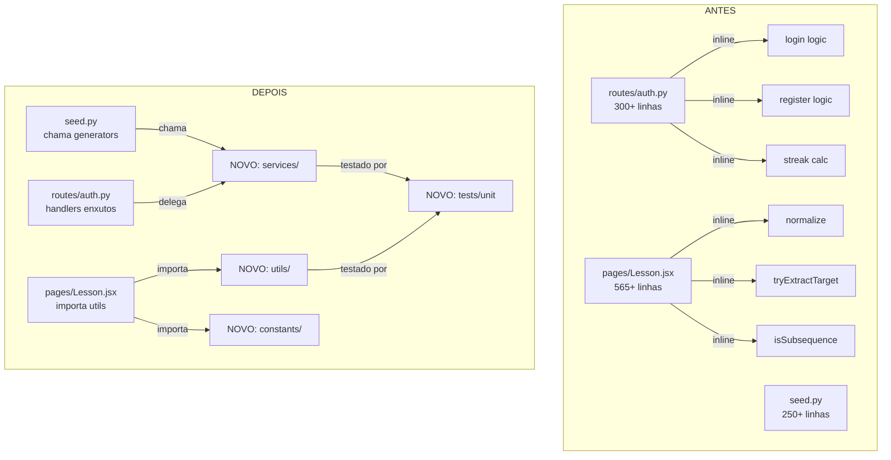

## Overview

Refactoring que extrai funções puras e especializadas de handlers/componentes
para módulos de serviço/utilitário, sem alterar comportamento. Cada função
extraída recebe testes unitários dedicados.

## Architecture



## Extrações detalhadas

### Backend: `app/services/auth.py`

| Função | Origem | Pureza | Assinatura |
|--------|--------|--------|------------|
| `validate_password` | `routes/auth.py:49-50` | Pura | `(password: str) -> bool` |
| `revoke_token` | `routes/auth.py:99-111,126-137` | DB | `(jti: str, token_type: str, user_id: int, expires_at: datetime, db: Session) -> bool` |
| `update_login_streak` | `routes/auth.py:73-83` | DB | `(user: User, today: date) -> None` |
| `calculate_streak` | dentro de update_login_streak | Pura | `(last_active_date: date, today: date) -> int` |

### Backend: `app/services/progress.py`

| Função | Origem | Pureza | Assinatura |
|--------|--------|--------|------------|
| `calculate_level` | `routes/progress.py:52-53` | Pura | `(xp: int, current_level: int) -> int` |
| `xp_needed_for_level` | derivada de calculate_level | Pura | `(level: int) -> int` |
| `check_version_conflict` | `routes/progress.py:35-38` | Pura | `(progress_version: int, data_version: int \| None) -> bool` |
| `apply_progress_update` | `routes/progress.py:41-48` | Modelo | `(progress: UserProgress, data: ProgressUpdate) -> None` |

### Backend: `app/services/images.py`

| Função | Origem | Pureza | Assinatura |
|--------|--------|--------|------------|
| `fetch_unsplash_image` | `routes/images.py:39-58` | HTTP | `async (query: str, access_key: str) -> dict \| None` |
| `build_fallback_image_response` | `routes/images.py:60-64` | Pura | `(word: str) -> dict` |

### Backend: `app/services/seed.py`

| Função | Origem | Pureza | Assinatura |
|--------|--------|--------|------------|
| `generate_simple_syllables` | `seed.py:107-115` | Pura | `() -> list[dict]` |
| `generate_complex_syllables` | `seed.py:119-153` | Pura | `() -> list[dict]` |
| `generate_blending_words` | `seed.py:156-173` | Pura | `() -> list[dict]` |
| `generate_words` | `seed.py:176-200` | Pura | `() -> list[dict]` |
| `generate_phrases` | `seed.py:203-215` | Pura | `() -> list[dict]` |
| `generate_sentences` | `seed.py:218-230` | Pura | `() -> list[dict]` |

### Backend: `app/utils/datetime.py`

| Função | Origem | Pureza | Assinatura |
|--------|--------|--------|------------|
| `datetime_to_iso` | `schemas/module.py:49-53,64-68` | Pura | `(value: Any) -> str \| None` |

### Frontend: `src/utils/string.js`

```javascript
export function normalize(s: string): string
export function stripSpaces(s: string): string
export function getExpectedChar(target: string, typedChars: string): string | null
```

### Frontend: `src/utils/array.js`

```javascript
export function isSubsequence(targetWords: string[], transcriptWords: string[]): boolean
```

### Frontend: `src/utils/speech.js`

```javascript
export function tryExtractTarget(transcript, target, sounds, lessonType, speechPrefixes): boolean
export function extractSpokenContent(transcript, target, sounds, lessonType, speechPrefixes): { content, isCorrect }
```

### Frontend: `src/utils/lesson.js`

```javascript
export function parseLessonContent(lesson): { syllables, word }
```

### Frontend: `src/utils/progress.js`

```javascript
export function buildProgressMap(progress: Array): Record<number, object>
export function findProgressByLessonId(progressList, lessonId): object | undefined
```

### Frontend: `src/utils/feedback.js`

```javascript
export function createFeedback(type, message): { id, type, message }
```

### Frontend: `src/utils/keyboard.js`

```javascript
export function createSyntheticKeyboardEvent(key: string): { key, preventDefault: () => void }
```

### Frontend: `src/utils/auth.js`

```javascript
export function storeAuthData(res: { access_token, refresh_token, user }): void
export function clearAuthData(): void
export function getStoredTokens(): { token: string | null, refreshToken: string | null }
export function getStoredUser(): object | null
```

### Frontend: `src/constants/lesson.js`

```javascript
export const POINTS = { letter: 10, syllable: 25, word: 50, ... }
export const SPEECH_PREFIXES = ['LETRA ', 'A LETRA ', ...]
export const SPEECH_TYPE_LABELS = { letter: 'LETRA', ... }
export const SPEECH_TYPE_NAMES = { letter: 'letra', ... }
export const SPEECH_TIMEOUTS = { letter: 4000, ... }
```

### Frontend: `src/constants/speech.js`

```javascript
export const LETTER_SOUNDS = { 'A': 'a', ... }
export const LETTER_WORDS = { 'A': 'abelha', ... }
```

### Frontend: `src/constants/modules.js`

```javascript
export const MODULE_ICONS = { vowel: '🔤', consonant: '🔠', ... }
```

### Frontend: `src/constants/keyboard.js`

```javascript
export const ROWS = [['Q','W','E',...], ...]
export const KEY_WIDTH = { default: 1, ' ': 6 }
export const ABNT2_KEYS = [['ESC','!1',...], ...]
```

## Migration strategy (no breaking changes)

Para cada extração, seguir estes passos:

1. **Criar** a função no novo arquivo
2. **Testar** com testes unitários
3. **Importar** no local original e **delegar** (substituir implementação inline por chamada)
4. **Verificar** que os testes existentes continuam passando
5. **Remover** código inline duplicado

```javascript
// ANTES (em Lesson.jsx):
const normalize = (s) => s.toUpperCase()...

// DEPOIS (em Lesson.jsx):
import { normalize } from '../utils/string'
// implementação inline removida
```

## Testes

### Backend: `tests/unit/`

Cada teste usa `pytest` padrão, sem dependências de DB ou HTTP:

```
tests/unit/
├── conftest.py              # fixtures compartilhadas
├── test_auth_services.py    # validate_password, calculate_streak
├── test_progress_services.py  # calculate_level, xp_needed_for_level
├── test_images_services.py  # build_fallback_image_response
├── test_seed_generators.py  # generate_* (verificar estrutura dos dicts)
└── test_datetime_utils.py   # datetime_to_iso
```

### Frontend: `src/utils/__tests__/`

Cada teste usa `vitest` (framework já configurado no projeto):

```
src/utils/__tests__/
├── string.test.js           # normalize, stripSpaces, getExpectedChar
├── array.test.js            # isSubsequence
├── speech.test.js           # tryExtractTarget, extractSpokenContent
├── lesson.test.js           # parseLessonContent
├── progress.test.js         # buildProgressMap
├── feedback.test.js         # createFeedback
├── keyboard.test.js         # createSyntheticKeyboardEvent
└── auth.test.js             # storeAuthData, getStoredTokens (mock localStorage)
```

## Critérios de aceitação por extração

Cada função extraída precisa:
1. Passar nos mesmos cenários que o código inline original cobria
2. Ter no mínimo 3 testes: caso normal, edge case (vazio/null), caso extremo
3. Ser importada e usada no local original, sem mudança de comportamento
4. Todos os testes existentes (pytest + npm test) continuam passando
